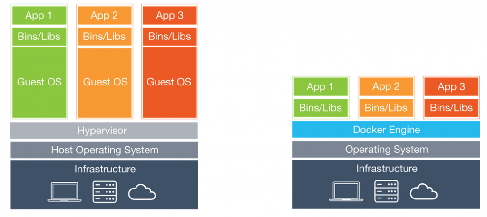
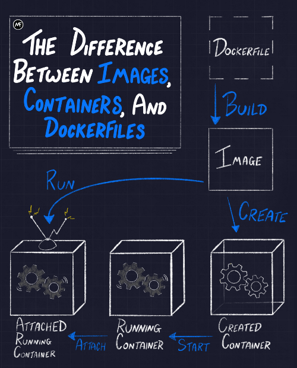
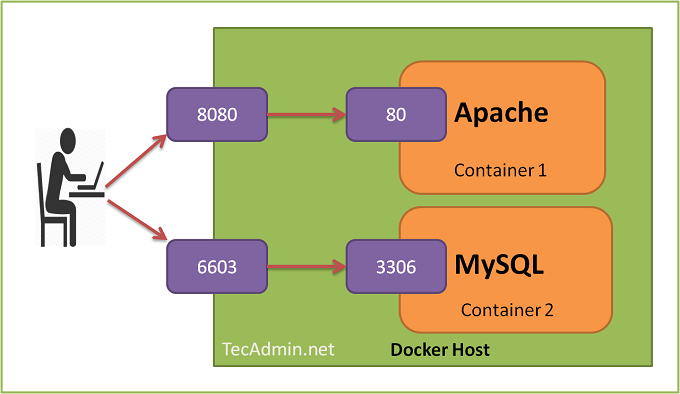

# Docker cheatsheet

**Contenedores Linux** es una tecnología que nos permite levantar cargas de trabajo aisladas dentro del mismo host. 

Cumplen un objetivo parecido a las máquinas virtuales. Se trata de compartir el mismo hardware para distintas aplicaciones. La diferencia es que los contenedores no necesitan instalar un sistema operativo nuevo. Esto significa un gran ahorro de memoria, disco, transmisiones de red y sobre todo tiempo. Se aprovechan mejor los recursos hardware.

Con los contenedores puedes levantar varios servicios aislados unos de otros y del propio host, de forma igual de rápida y eficiente que si los levantasemos fuera de contenedores.

**Docker** es la tecnología que nos permite interactuar y crear contenedores de forma sencilla.




Los contenedores se levantan a partir de **imágenes**, que son plantillas que incluyen todo lo necesario para ejecutar el servicio. Estas plantillas se definen en un **Dockerfile**. Se pueden construir y ejecutar en cualquier tipo de sistema de la misma forma.




## Links útiles Docker

Raṕida introducción a los contenedores: [https://www.docker.com/resources/what-container](https://www.docker.com/resources/what-container)

DockerHub: [https://hub.docker.com](https://hub.docker.com)

## Instalación

Docker for Windows: [https://docs.docker.com/docker-for-windows/install/](https://docs.docker.com/docker-for-windows/install/)

Instalación en Linux a partir de script:

```
curl -fsSL https://get.docker.com -o get-docker.sh
sh get-docker.sh
systemctl start docker
systemctl enable docker
sudo usermod -aG docker <USUARIO>
```


#### Levantar contenedores
`docker run -p <PUERTO LOCAL>:<PUERTO CONTENEDOR> <IMAGEN>`

Ejemplo:

`docker run -p 8080:80 nginx`

Para levantar en background: `-d`

Ejemplo:

`docker run -d -p 8080:80 nginx`



#### Listar contenedores

Contenedores levantados

`docker ps`

Todos (parados y levantados)

`docker ps -a`

#### Dar un nombre a un contenedor

Al levantarlo:

`docker run --name <NOMBRE> <IMAGEN>`

Renombrar uno ya existente

`docker rename <ACTUAL> <NUEVO>`

#### Parar un contenedor

`docker stop <NOMBRE O ID>`

#### Levantar un contenedor parado

`docker start <NOMBRE O ID>`

#### Eliminar un contenedor

`docker rm <NOMBRE O ID>`

Eliminar un contenedor encendido

`docker rm -f <NOMBRE O ID>`

#### Obtener todos los datos de un contenedor

`docker inspect <NOMBRE O ID>`

#### Ejecutar comandos dentro del contenedor

`docker exec <NOMBRE O ID> <COMANDO>`

Abrir un terminal dentro de un contenedor

`docker exec -ti <NOMBRE O ID> bash` o `docker exec -ti <NOMBRE O ID> sh`

Crear un nuevo contenedor y abrir un terminal en su interior

`docker run -it <IMAGEN> bash`. Por ejemplo `docker run -it ubuntu bash`

#### Imprimir logs de un contenedor

`docker logs <NOMBRE O ID> <COMANDO>`

Para actualización automática

`docker logs -f <NOMBRE O ID> <COMANDO>`

#### Ejecutar contenedor personalizando el comando inicial (CMD)

Simplemente añadimos el comando después dela imagen

`docker run -p 8080:808 <OTRAS OPCIONES> <IMAGEN> <COMANDO>`

Por ejemplo:

`docker run -p 8080:8080 tomcat catalina.sh debug`

En este caso el CMD sería `catalina.sh debug`

## Volúmenes

#### Montar un directorio o archivo local

`docker run -v <RUTA LOCAL>:<RUTA EN EL CONTENEDOR>:<PERMISOS OPCIONAL> <IMAGEN>`

#### Crear un volumen nuevo

`docker volume create <NOMBRE VOLUMEN>`

#### Montar un volumen en un contenedor

`docker run -v <NOMBRE VOLUMEN>:<RUTA EN EL CONTENEDOR>:<PERMISOS OPCIONAL> <IMAGEN>`


## Redes

#### Crear una red nueva para tu proyecto

`docker network create <NOMBRE RED>`

#### Levantar un contenedor nuevo en esa red

`docker run --network <NOMBRE RED> <IMAGEN>`

#### Conetar un conenedor existente a esa red

`docker network connect <NOMBRE RED> <CONTENEDOR>`


## Proceso principal o PID 1

Siempre que trabajemos con contenedores es fundamental asegurarnos de que el proceso que se está ejecutando dentro del conenedor lo haga con PID 1. Se pueden ver los procesos y su PID con el comando `ps aux`. 

En caso de que necesitemos ejecutar algún otro proceso como un script de bash antes de comenzar el que será el proceso principal, podemos utilizar el comando de bash `exec` para sustituir el proceso de bash con el proceso que queramos (python, etc)

Puedes ver un ejemplo en el Dockerfile de flask-app y en el archivo docker-entrypoint.sh

El procedo con PID1 es importante en Docker porque será el que reciba las señales como SIGTERM al hacer docker stop. También es del que se muestran y almacenan los logs, o el que marca si el contenedor sigue encendido o está apagado.

Puedes ver los procesos que pertenecen a cada contenedor con `docker top <CONTENEDOR>`

## Logs

Docker muestra y almacena por defecto todos los logs que el proceso del contenedor imprima por STDOUT o STDERR.

Estos logs se pueden ver con el comando `docker logs <NOMBRE O ID>`

Por defecto Docker no considera ningún otro archivo de logs que pueda haber dentro del contenedor. Todos los logs de la aplicación se deben imprimir por STDOUT y STDERR. Esto facilita mucho el desarrollo ya que no es necesario configurar distintos sistemas de log por entorno, etc. Todo lo que se imprima por esos streams queda almacenado.

Los logs de todos los contenedores se almacenan en el directorio `/var/lib/docker/containers` Se almacenan en formato JSON y pueden ser leídos por cualquier sistema de log forwarding (FluentD, Logstash, Filebeat, etc).

También se puede integrar con varios sistemas de logs mediate drivers que ya vienen incluidos con Docker, para que estos logs se envíen directamente a estos sistemas en lugar de almacenarlos en disco: [https://docs.docker.com/config/containers/logging/configure/](https://docs.docker.com/config/containers/logging/configure/)
