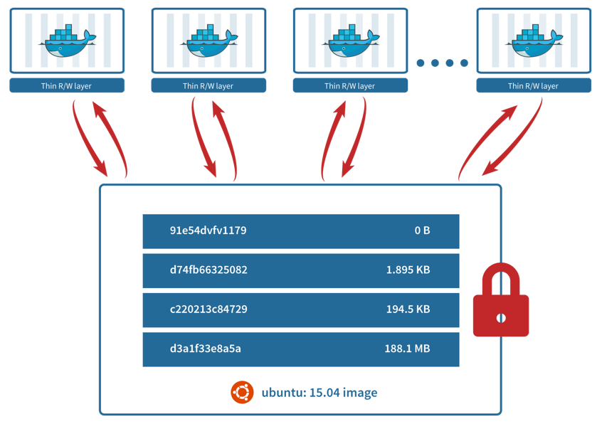
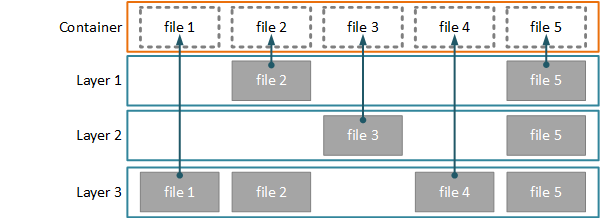
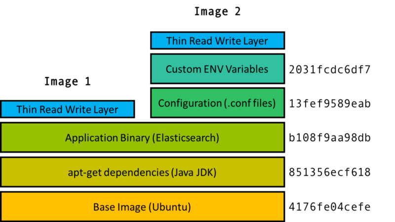

# Dockerfile e imágenes de Docker

Una imagen de Docker es una instantánea del sistema de archivos de un contenedor, que contiene todas las dependencias necesarias para ejecutar el software para el que esté pensada. Esta imagen se puede distribuir para que ese contenedor se pueda levantar en cualquier host.

Las imágenes se construyen a partir de un Dockerfile, un fichero que contiene los pasos para ir obteniendo e instalando todas las dependencias que tiene nuestra imagen.

Estas plantillas o imágenes están formadas por capas que se reutilizan de unas imágenes a otras. De forma que se puede ahorrar tiempo y recursos reutilizándolas entre distintos servicios que tengan partes en común.

Las capas se sobreponen unas encima de otras, cada una añade los archivos que se han modificado durante la creación de esa capa. El resultado es la imagen que nosotros levantamos cuando creamos un contenedor, que contiene todos los archivos necesarios.

#### Links útiles

Referencia comandos Dockerfile: [https://docs.docker.com/engine/reference/builder/](https://docs.docker.com/engine/reference/builder)

Buenas prácticas Dockerfile: [https://docs.docker.com/develop/develop-images/dockerfile_best-practices/](https://docs.docker.com/develop/develop-images/dockerfile_best-practices/)

Diferencias entre ENTRYPOINT y CMD: [https://docs.docker.com/engine/reference/builder/#understand-how-cmd-and-entrypoint-interact/](hhttps://docs.docker.com/engine/reference/builder/#understand-how-cmd-and-entrypoint-interact)

Diferencias entre COPY y ADD: [https://medium.com/@Grigorkh/dockerfile-add-vs-copy-d120e72d09dd](https://medium.com/@Grigorkh/dockerfile-add-vs-copy-d120e72d09dd)

#### Compados básicos Dockerfile

`FROM` Imagen de Docker base

`WORKDIR` Establece la carpeta raiz para todos los demás comandos

`RUN` Ejecutar comandos dentro de la imagen. Por ejemplo, instalar dependencias, librerías, contruir la aplicación etc.

`COPY` Copia archivos y carpetas desde el host a la imagen

`ADD` Similar a COPY pero acepta links para descargar el archivo de Internet

`ENTRYPOINT` Comando que se ejecutará al levantar el contenedor 

`CMD` Puede ser bien el comando que se ejecutará al levantar el contenedor (en caso de que la imagen no tenga entrypoint), o bien opciones que se añaden al entrypoint. La diferencia con el entrypoint es que CMD se puede personalizar al crear el contenedor con `docker run`

Ver [https://docs.docker.com/engine/reference/builder/#understand-how-cmd-and-entrypoint-interact/](hhttps://docs.docker.com/engine/reference/builder/#understand-how-cmd-and-entrypoint-interact)

`EXPOSE` Especifica el (o los) puerto(s) que va a escuchar el contenedor

`VOLUME` Especifica el/los directorios que deberían contener datos persistentes

`LABEL` Sirve para añadir metadata a las imágenes (información del autor, fecha, etc.)

`ENV` Para declarar variables de entorno que estarán presentes tanto en el resto de pasos del Dockerfile como en el contenedor final

`ARG` Para declarar variables que podemos pasar al Dockerfile cuando ejecutemos `docker build` mediante la opción `--build-arg`. Estarán disponibles como variables de entorno para el resto de pasos del Dockerfile.

#### Construir imagen de Docker

Desde el mismo directorio en el que se encuentra el Dockerfile

`docker build -t <USUARIO>/<NOMBRE IMAGEN>:<TAG OPCIONAL> .`

Para pasarle parámetros decalrados con `ARG`:

`docker build -t <USUARIO>/<NOMBRE IMAGEN>:<TAG OPCIONAL> --build-arg NAME=VALUE .`

Para evitar el uso de cache:

`docker build -t <USUARIO>/<NOMBRE IMAGEN>:<TAG OPCIONAL> --no-cache . `

Construir la imagen utilizando BuildKit:

`DOCKER_BUILDKIT=1 docker build -t <USUARIO>/<NOMBRE IMAGEN>:<TAG OPCIONAL> .`

Más info sobre BuildKit: [https://docs.docker.com/develop/develop-images/build_enhancements/](https://docs.docker.com/develop/develop-images/build_enhancements/)

#### Subir imagen a DockerHub

`docker push USUARIO>/<NOMBRE IMAGEN>:<TAG OPCIONAL>`

## Dockerfile multi-stage

Son Dockerfiles que utilizan varias imágenes base. Esto es muy útil para ejecutar distintos pasos para construir mi aplicación, en distintas imágenes que continen software específico, y finalmente se copian los artefactos generados en la imagen definitiva.

Lo más importante a tener en cuenta es que la imagen final que se genera es la del último `FROM` que utilicemos. Todas las anteriores son contingentes solo para la construcción de la imagen.

Para copiar artefactos entre un stage y otro, utilizamos el comando `COPY`:

`COPY --from=<STAGE> <CARPETA ORIGEN> <CARPETA DESTINO>`

Ver la aplicación flask-app para un ejemplo.

Podemos hacer `docker build` hasta una etapa en concreto con la opción `--target <ALIAS DE LA ETAPA>`